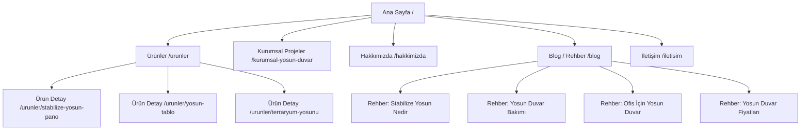
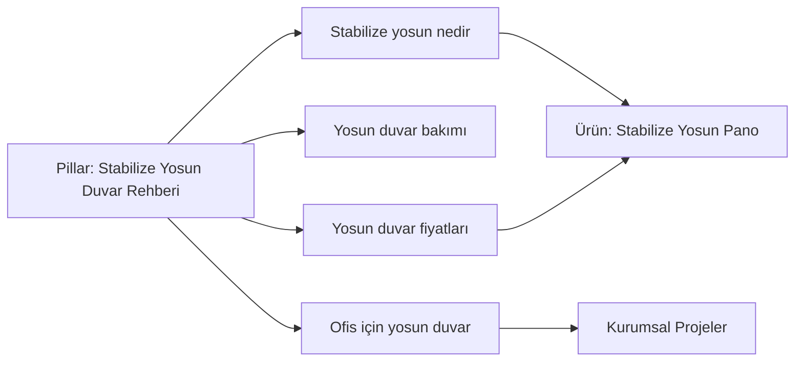

# Dağ Yosunu — Premium Vitrin Sitesi | Antigravity İmplementasyon Planı

> **Amaç:** Bir dağ yosunu (stabilize / dekoratif yosun) satıcısı için **premium algı yaratan vitrin sitesi** kurmak. Faz 1'de satış/ödeme yok; marka + ürün vitrini + güçlü SEO. Mimari, Faz 2'de tam e-ticarete sıfır yeniden yazımla geçecek şekilde kurulacak.
>
> **Bu doküman Antigravity'ye context/görev olarak verilmek üzere yazılmıştır.** Her bölüm agent'ın doğrudan uygulayabileceği kararlar içerir. Sonundaki "Varsayımlar" bölümünü kendi gerçek bilgilerinle güncelle.

---

## 0. Varsayımlar — ÖNCE BUNLARI ONAYLA

### Marka Künyesi (kesinleşti)

| Alan | Değer |
|------|-------|
| **Marka adı** | **Eliva Moss** |
| **Domain** | **elivamoss.com.tr** |
| **Telefon** | 0532 486 67 67 |
| **WhatsApp** | 0532 486 67 67 → `https://wa.me/905324866767` |
| **İletişim yöntemi** | Yalnızca **WhatsApp + telefonla arama**. İletişim formu YOK. |
| **Ürünler** | Şimdilik birkaç göstermelik ürün (vitrin) |

**Teknik format (agent kullansın):**
- Telefon linki: `tel:+905324866767`
- WhatsApp linki: `https://wa.me/905324866767?text=Merhaba, Eliva Moss ürünleri hakkında bilgi almak istiyorum.`

### Teknik Kararlar (kesinleşti)

| Alan | Değer |
|------|-------|
| **Stack** | **Saf HTML + CSS + JavaScript** (framework yok, build aracı yok) |
| **Hosting** | **Metunic** (paylaşımlı hosting / cPanel — dosyalar FTP veya File Manager ile yüklenir) |
| **Dil** | Türkçe (domain `.com.tr`) |
| **Konum** | Antalya — **ama sitede konum BELİRTİLMEYECEK.** Local SEO, adres ve `LocalBusiness` schema kullanılmayacak; sadece telefon/WhatsApp iletişim. |

---

## 1. Hedefler ve Fazlar

**Faz 1 — Vitrin (bu plan):**
- Premium marka hissi veren, hızlı, mobil öncelikli statik site
- Ürün vitrini (fiyat yerine WhatsApp + telefon CTA'ları — form yok)
- SEO'da zirveyi hedefleyen içerik mimarisi (ürün + bilgi içeriği kümeleri)
- Antigravity ile üretilmiş tutarlı, premium görseller

**Faz 2 — E-ticaret (sonra):**
- Sepet, ödeme, sipariş yönetimi → Bölüm 11'de geçiş yol haritası

**Başarı kriterleri (Faz 1):**
- Lighthouse: Performance/SEO/Best-Practices/Accessibility ≥ 95
- LCP < 2.0s, CLS < 0.1, INP < 200ms
- Her hedef anahtar kelime için doğru niyete (intent) hizmet eden tek bir sayfa
- Zengin sonuçlar (rich results): Product, FAQ, Breadcrumb, LocalBusiness schema geçerli

---

## 2. Teknik Stack ve Mimari

**Yaklaşım:** Framework ve build aracı yok. **Çok sayfalı saf statik HTML** + vanilla CSS + minimum vanilla JS. Her sayfa gerçek bir `.html` dosyası → her URL tam statik sunulur, SEO için en güvenli yapı. Metunic paylaşımlı hostinge FTP ile yüklenir.

**Teknoloji seçimleri:**
- **HTML5** — her sayfa kendi başına tam statik (header/footer her sayfaya gömülü)
- **Vanilla CSS** — tasarım token'ları `:root` CSS değişkenleriyle (Bölüm 3). Tailwind YOK (CDN Tailwind CWV'yi düşürür; saf CSS daha hızlı). Tek `styles.css` + istenirse sayfa bazlı küçük CSS.
- **Vanilla JS** — yalnızca: mobil menü, scroll'da fade-in, ürün galerisi, yüzen WhatsApp butonu. Framework yok, bağımlılık yok.
- **Görseller:** elle **WebP** (ve mümkünse AVIF) üret; `<picture>` + `srcset` ile responsive. Lazy-load (hero hariç).
- **Fontlar:** self-host `woff2` (latin-ext subset — Türkçe karakter şart), `<link rel="preload">`.
- **Sitemap/robots:** elle yazılmış `sitemap.xml` + `robots.txt` (public kökte).
- **.htaccess** (Apache/Metunic için): HTTPS yönlendirme, www/non-www kanonik tercih, gzip/brotli sıkıştırma, statik dosya cache header'ları, uzantısız temiz URL.

**Temiz URL stratejisi (Metunic/Apache):** Her sayfa `klasör/index.html` biçiminde → URL `.html` uzantısız görünür:
- `/urunler/stabilize-yosun-pano/index.html` → `elivamoss.com.tr/urunler/stabilize-yosun-pano/`

**Mimari / Site Haritası:**



**Klasör yapısı (doğrudan Metunic `public_html`'e yüklenecek hali):**
```
public_html/
  index.html                     (Ana sayfa)
  hakkimizda/index.html
  iletisim/index.html
  kurumsal-yosun-duvar/index.html
  urunler/
    index.html                   (ürün listesi)
    stabilize-yosun-pano/index.html
    yastik-yosunu-tablo/index.html
    terraryum-yosunu-seti/index.html
  blog/
    index.html
    stabilize-yosun-nedir/index.html
    yosun-duvar-bakimi/index.html
    ...
  assets/
    css/styles.css
    js/main.js
    fonts/                        (woff2 self-host)
    img/                          (WebP/AVIF görseller)
  sitemap.xml
  robots.txt
  .htaccess
  favicon.ico
  og-image.jpg
```

> **Header/footer tekrarı:** Framework olmadığı için ortak header/footer her HTML'e gömülür. Antigravity agent'ı bunu tek kaynaktan tüm sayfalara tutarlı yazar/günceller. (JS ile inject etmek yerine statik gömmek SEO açısından daha güvenli.)

---

## 3. Premium Tasarım Sistemi

Niş "doğa + lüks". Hedef his: butik bir galeri / yüksek segment iç mimari markası — bahçe malzemesi değil.

### 3.1 Renk Paleti (`:root` CSS değişkeni olarak tanımla)

| Rol | İsim | HEX | Kullanım |
|-----|------|-----|----------|
| Birincil koyu | Derin Orman | `#1C2E24` | Arka plan blokları, footer, koyu bölümler |
| Birincil koyu+ | Gece Yosunu | `#14231B` | En koyu zeminler |
| İkincil | Adaçayı | `#8FA68E` | İkincil vurgular, ayraçlar |
| Zemin açık | Kemik/Krem | `#F6F2E9` | Ana açık arka plan |
| Metin | Sıcak Kömür | `#1A1A17` | Gövde metni |
| **Aksan (premium)** | **Antik Pirinç** | `#B08D57` | CTA, ince çizgiler, ikon vurguları |
| Aksan açık | Şampanya | `#D9C7A3` | Hover, altın tonu detaylar |

**Kullanım kuralı:** Pirinç aksanı az ve stratejik kullan (CTA, bölüm başlığı altı ince çizgi, hover). Lüks hissi "az ama kaliteli" ile gelir.

### 3.2 Tipografi

- **Başlıklar (Display):** `Fraunces` — editoryal, lüks serif (değişken font; opsiyonel "soft" eksenle organik his). *Klasik alternatif: Cormorant Garamond.*
- **Gövde / UI:** `Inter` — net, yüksek okunabilirlik.
- **Eyebrow/üst etiket:** Inter, büyük harf, `letter-spacing: 0.15em`, pirinç renk.

**Tip ölçeği (rem):** 0.875 / 1 / 1.25 / 1.5 / 2 / 2.75 / 3.75. Başlıklarda `line-height: 1.1`, gövdede `1.65`. Tüm ölçekleri `clamp()` ile akışkan yap.
**Fontları self-host et** (`assets/fonts/`, woff2, latin+latin-ext subset — Türkçe karakterler için latin-ext şart), `<head>`'de `<link rel="preload" as="font" crossorigin>`.

### 3.3 Düzen / His Dili

- Bol **beyaz/negatif alan** (lüks = nefes alan tasarım)
- Geniş bölüm padding'leri (`clamp(4rem, 8vw, 8rem)`)
- İnce pirinç ayraç çizgileri; gölge yerine ince border tercih et
- Görsellerde `border-radius` düşük (2–4px) → galeri/müze hissi, yuvarlak köşeli "web app" hissi değil
- Mikro etkileşim: hover'da görsel hafif zoom (scale 1.03, 600ms ease), metin fade-in on-scroll
- Mobil öncelikli; tüm tipografi `clamp()` ile akışkan

---

## 4. Sayfa Yapısı ve Bileşenler

### Ana Sayfa
1. **Hero** — tam ekran premium yosun duvar görseli + kısa güçlü başlık + pirinç CTA ("Koleksiyonu Keşfet") + ikincil "WhatsApp'tan Bilgi Al" butonu
2. **Marka vaadi** — 3 sütun (ör: Doğal & stabilize / Bakım gerektirmez / El işçiliği)
3. **Öne çıkan ürünler** — 3–4 ProductCard grid
4. **Kurumsal projeler** — büyük görsel + "Ofisiniz/mekânınız için" CTA
5. **Marka hikâyesi** — dağ/orman atmosfer görseli + kısa anlatı
6. **Sosyal kanıt** — referanslar/proje logoları (varsa)
7. **SSS** (FAQ schema'lı)
8. **Son CTA bölümü** — "Projeniz için bize ulaşın" + WhatsApp + Ara butonları yan yana

### Ürün Detay (Content Collection'dan)
- Galeri (çoklu görsel), ürün adı, açıklama, özellikler tablosu, bakım notu, **WhatsApp'tan Sor** + **Hemen Ara** butonları, ilgili ürünler, Product + Breadcrumb schema. *(Faz 1'de fiyat yerine "Fiyat için WhatsApp'tan ulaşın".)*

### İletişim Sayfası (form YOK)
- Büyük WhatsApp butonu (`wa.me` linki, ön-doldurulmuş mesajla) + tıklanabilir telefon (`tel:`)
- Çalışma saatleri (varsa), kısa "Nasıl yardımcı olabiliriz?" metni
- Konum/adres/harita YOK (bilinçli tercih)

### Bileşen listesi (Antigravity üret):
`BaseLayout`, `SEOHead`, `Header` (sticky, scroll'da arka plan değişir), `Footer`, `Hero`, `ProductCard`, `ProductGallery`, `FeatureGrid`, `CTASection` (WhatsApp + Ara), `FAQ`, `Breadcrumbs`, `WhatsAppButton` (sabit, sağ altta yüzen), `ContactBar` (WhatsApp + tel), `SchemaOrg`.

> **Tüm CTA/iletişim butonları** `https://wa.me/905324866767?text=...` ve `tel:+905324866767` linklerini kullanır. Footer'da da marka adı **Eliva Moss**, telefon ve WhatsApp görünür olmalı.

---

## 5. Görsel Üretimi (Antigravity için hazır prompt'lar)

**Global stil kuralı (her görselde uygula):** sinematik yumuşak doğal ışık, sığ alan derinliği, zengin derin yeşiller + krem + sıcak pirinç tonları, lüks iç mimari/editoryal estetik, yüksek detay, foto-gerçekçi, markasız. Çıktıyı **AVIF/WebP**'e çevir, hero için `1920×1080`+ üret.

1. **Hero:** `Lüks minimalist bir salonda zeminden tavana kaplayan stabilize yosun duvar; derin orman yeşili dokular, krem duvarlar, pirinç detaylı modern mobilya, yumuşak gün ışığı, sinematik, editoryal iç mimari fotoğrafı, 16:9`
2. **Ürün çekimi (pano):** `Tek bir kare stabilize yosun pano, nötr krem arka plan, stüdyo ışığı, yosun dokusu net görünür, premium ürün fotoğrafı, hafif üstten gölge, 4:5`
3. **Makro doku:** `Stabilize yosun yüzeyinin makro yakın çekimi, kadifemsi yeşil doku, zengin detay, yumuşak ışık, 3:2`
4. **Yaşam alanı / lifestyle:** `Butik bir ofis lobisinde çerçeveli yosun tablo, ahşap ve pirinç detaylar, sıcak atmosfer, mimari dergi tarzı, 3:2`
5. **Marka hikâyesi:** `Sabah sisli dağ ormanı, yosun kaplı kayalar ve ağaç gövdeleri, puslu atmosferik ışık, dingin, sinematik doğa fotoğrafı, 16:9`
6. **OG görseli:** `Ortada yosun duvar dokusu, üst/alt kısımda "Eliva Moss" markası için boşluk, derin yeşil + pirinç tonları, 1200×630`

> Görselleri `src/assets/images/` altına kaydet, anlamlı dosya adı ver (`stabilize-yosun-duvar-salon.webp` gibi — dosya adı da SEO sinyalidir), her `<Image>`'a betimleyici Türkçe `alt` yaz.

---

## 6. SEO Stratejisi — "Zirve" İçin

### 6.1 Anahtar Kelime Mimarisi (niyet bazlı)

Her sayfa **tek bir ana niyete** hizmet eder. Kannibalizasyon (aynı kelimeye birden çok sayfa) yok.

**Ticari/İşlemsel (ürün sayfaları):**
`stabilize yosun`, `yosun duvar`, `dekoratif yosun`, `yosun pano`, `yosun tablo`, `terraryum yosunu`, `canlı yosun duvar`, `moss wall`

**Kurumsal:** `ofis için yosun duvar`, `kurumsal yosun duvar`, `yosun duvar projesi`

**Bilgisel (içerik kümesi — topical authority):**
`stabilize yosun nedir`, `yosun duvar bakımı`, `yosun duvar fiyatları`, `yosun duvar nasıl yapılır`, `dağ yosunu bakımı`, `yastık yosunu`, `yosun duvar avantajları`

> **Yerel SEO kullanılmayacak** — konum (Antalya) sitede belirtilmeyecek. Şehir bazlı anahtar kelime, adres veya `LocalBusiness` schema YOK. Hedefleme Türkiye geneli.

### 6.2 Topical Authority / İçerik Kümesi

Google'da zirve = konusal otorite. Bilgisel yazılar (pillar + cluster) ticari sayfalara iç link verir:



Her bilgisel yazı → ilgili ürün/kurumsal sayfaya en az 1 bağlamsal iç link.

### 6.3 On-Page SEO (her sayfa için)
- Benzersiz `<title>` (≤ 60 karakter, ana kelime başta) ve `meta description` (≤ 155)
- Tek `<h1>`, mantıklı `<h2>/<h3>` hiyerarşisi
- Anlamlı/temiz URL (`/urunler/stabilize-yosun-pano`)
- Her sayfaya `canonical`
- Open Graph + Twitter Card meta'ları
- Betimleyici `alt` metinleri, optimize dosya adları
- İç link stratejisi (breadcrumb + bağlamsal linkler)

### 6.4 Yapılandırılmış Veri (Schema.org — her HTML'e inline JSON-LD)
- `Organization` — her sayfada. `name: "Eliva Moss"`, `url: "https://elivamoss.com.tr"`, `telephone: "+905324866767"`, `logo`, `contactPoint` (telephone + `contactType: "customer service"` + `availableLanguage: "Turkish"`), varsa `sameAs` (sosyal hesaplar). **Adres/konum eklenmeyecek, `LocalBusiness` kullanılmayacak.**
- `Product` — ürün sayfalarında (fiyat yoksa `offers` yerine açıklama; varsa `AggregateRating`)
- `BreadcrumbList` — tüm iç sayfalar
- `FAQPage` — SSS ve rehber yazılarında (zengin sonuç fırsatı)
- `BlogPosting` — rehber yazıları
- `ImageObject` — hero/OG

### 6.5 Teknik SEO
- Elle yazılmış `sitemap.xml` (tüm sayfalar) + `robots.txt` (sitemap referansıyla)
- `.htaccess`: HTTPS zorunlu, www↔non-www kanonik, gzip/brotli, cache-control header'ları
- Her sayfada `<link rel="canonical">`
- Hız: WebP/AVIF, lazy-load (hero hariç — hero `loading="eager"` + `fetchpriority="high"`), font `preload`, kritik CSS `<head>`'de inline, JS `defer`
- Mobil uyumluluk + erişilebilirlik (kontrast, odak halkaları, ARIA)

---

## 7. İçerik Planı

**Statik sayfa metinleri:** Her ürün için 150–300 kelime özgün, fayda odaklı açıklama (bakım avantajı, doğallık, el işçiliği, mekâna etkisi). Genel/klişe değil, somut.

**Blog/Rehber (ilk 4 yazı — topical authority başlangıcı):**
1. "Stabilize Yosun Nedir, Canlı Yosundan Farkı Ne?" (pillar) — 1200+ kelime
2. "Yosun Duvar Bakımı: Bilmen Gereken Her Şey" — SSS + schema
3. "Ofis ve Mağazalar İçin Yosun Duvar: Neden Tercih Ediliyor?"
4. "Yosun Duvar Fiyatlarını Ne Belirler?" (fiyat niyetini yakalar, satışa yönlendirir)

Her yazı: net `<h2>` yapısı, görsel, SSS bloğu, ürüne CTA/iç link.

---

## 8. Performans / Core Web Vitals Kontrol Listesi
- [ ] Hero görseli optimize + `fetchpriority="high"`, diğerleri lazy
- [ ] Fontlar self-host + `preload` + `font-display: swap`
- [ ] Sıfır/minimum client-side JS (Astro islands sadece gerekirse)
- [ ] Tüm görseller AVIF/WebP + responsive `srcset`
- [ ] Boyutlandırma ile CLS sıfıra yakın (img width/height set)
- [ ] Lighthouse CI / build sonrası manuel skor kontrolü (hedef ≥ 95)

---

## 9. Antigravity — Adım Adım Görev Listesi

Agent'a sırayla verilecek görevler:

1. **Scaffold:** Bölüm 2'deki `public_html/` klasör yapısını kur. Boş HTML iskeletleri + `assets/css/styles.css` + `assets/js/main.js` oluştur.
2. **Tasarım token'ları + global CSS:** Bölüm 3'teki renk/tipografi/spacing'i `:root` değişkenleri olarak `styles.css`'e işle. Fraunces + Inter woff2'yi `assets/fonts/`'a self-host et (latin-ext), `<head>`'de preload.
3. **Ortak head + header + footer:** Her sayfaya gömülecek tutarlı head bloğu (title/description/canonical/OG/Twitter + Organization JSON-LD), sticky header ve footer (marka adı, telefon, WhatsApp). Tek kaynaktan tüm sayfalara yaz.
4. **Veri kaynağı:** `products` listesini tek bir referans (Bölüm 10) olarak tut; agent bundan statik ürün HTML'lerini üretsin.
5. **Bileşenler/bölümler:** Bölüm 4'teki tüm UI parçalarını (Hero, ProductCard grid, galeri, FAQ, CTA, yüzen WhatsApp) premium tasarım sistemine göre CSS/JS ile kur.
6. **Sayfalar:** Ana sayfa + Ürünler listesi + her ürün için statik detay sayfası + Kurumsal + Hakkımızda + Blog listesi + yazı detayları + İletişim (form yok; WhatsApp + telefon). Birkaç göstermelik ürün oluştur.
7. **Görseller:** Bölüm 5 prompt'larıyla tüm görselleri üret, **WebP/AVIF**'e çevir, `assets/img/`'a optimize isimlerle kaydet, `<picture>`+`srcset` ve betimleyici `alt` ile yerleştir.
8. **İçerik:** Bölüm 7 ürün açıklamaları + ilk 4 rehber yazısını özgün olarak yaz.
9. **Schema:** Bölüm 6.4'teki JSON-LD'leri (Organization, Product, Breadcrumb, FAQ, BlogPosting) ilgili HTML'lere inline ekle.
10. **Teknik SEO + Metunic:** `sitemap.xml`, `robots.txt`, `.htaccess` (HTTPS/kanonik/gzip/cache/temiz URL), tüm canonical + meta'lar, iç linkleme.
11. **Performans geçişi:** Bölüm 8 kontrol listesini uygula; Lighthouse ölç, ≥95 olana kadar iyileştir.
12. **Yayınlama (Metunic):** Tüm `public_html` içeriğini FTP (ör. FileZilla) veya cPanel File Manager ile Metunic'e yükle. HTTPS/SSL'i (Let's Encrypt) aç, canlı doğrula. *(Antigravity dosyaları üretir; FTP yüklemesini sen yaparsın — gerekirse adım adım anlatırım.)*

---

## 10. İçerik Modeli (Faz 2'ye hazır)

Ürünleri tek bir referans listesinde tut (ör. `assets/js/products.js` ya da dokümante bir tablo). Agent bu listeden statik ürün HTML'lerini üretir. Alanları şimdiden e-ticarete uygun tanımla ki geçişte veri taşınmasın:

```js
// assets/js/products.js — tek kaynak; statik sayfalar buradan üretilir
const products = [
  {
    title: "Stabilize Yosun Pano",
    slug: "stabilize-yosun-pano",
    description: "...",
    images: ["stabilize-yosun-pano-1.webp", "stabilize-yosun-pano-2.webp"],
    features: ["Bakım gerektirmez", "Doğal", "El işçiliği"],
    category: "panolar",
    sku: "YSN-001",     // Faz 2 için hazır
    price: null,         // Faz 1'de boş; Faz 2'de doldurulur
    inStock: true,
    seoTitle: "Stabilize Yosun Pano | Eliva Moss",
    seoDescription: "..."
  }
  // ... diğer göstermelik ürünler
];
```

> **Not:** Ürün listesi/detay sayfaları SEO için **statik HTML olarak yazılır** (JS ile client-side render edilmez). Bu dosya tek doğruluk kaynağıdır; Faz 2'de aynı yapı sepet/ödeme ile uzatılır.

---

## 11. Faz 2 — E-Ticarete Geçiş Yol Haritası
- Fiyat/stok alanlarını doldur (model zaten hazır)
- Ödeme: **iyzico / PayTR** (TR pazarı). Metunic paylaşımlı hostingde saf statik yetmeyeceği için ödeme/sepet aşamasında ya hafif bir backend (PHP, Metunic destekler) ya da headless çözüm (Shopify Lite / Medusa) değerlendirilir.
- Sepet + checkout: vanilla JS sepet (localStorage) + ödeme sağlayıcı entegrasyonu
- Sipariş yönetimi + e-posta bildirimleri
- `Product` schema'ya `offers` (fiyat, availability) ekle → zengin sonuçlarda fiyat görünür
- Vitrin sayfaları aynen kalır; sadece WhatsApp/Ara CTA'larının yanına "Sepete Ekle" eklenir (WhatsApp seçeneği korunabilir)

---

### Özet
Bu plan; **saf HTML/CSS/JS** ile premium tasarım sistemi + Antigravity'nin üreteceği tutarlı görseller + niyet bazlı SEO mimarisi + topical authority içerik kümesini, Metunic hostinge yüklenebilir tek bir uygulanabilir yol haritasında birleştirir. Faz 1 saf vitrin olsa da içerik modeli ve dosya yapısı Faz 2 e-ticarete minimum yeniden yazımla geçecek şekilde kurgulanmıştır.
